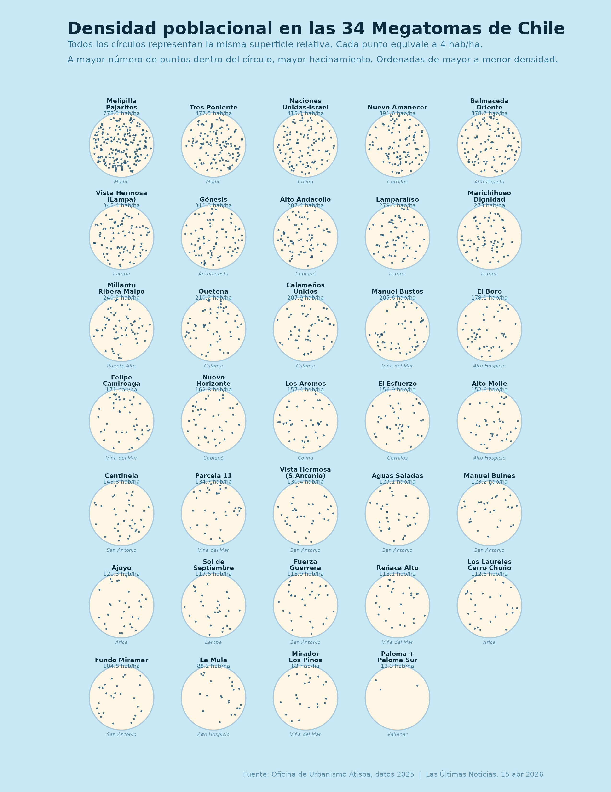

Chile tiene **34 megatomas** que concentran una población de **203.248 personas**, distribuidas en 47.899 viviendas repartidas en 2.038 hectáreas, según el estudio de la oficina de urbanismo Atisba publicado por *Las Últimas Noticias* (15 de abril de 2026, con datos de 2025). El fenómeno se concentra en el norte minero, que recogió la presión migratoria, y en las periferias de las regiones Metropolitana y de Valparaíso.

Las cifras agregadas, sin embargo, esconden una enorme heterogeneidad. ¿Cómo comparar el hacinamiento de una toma de 6 hectáreas en Maipú con otra de 926 hectáreas en Vallenar? La respuesta visual que propongo: **círculos de igual superficie relativa, donde cada punto equivale a 4 hab/ha**. A más puntos dentro del círculo, mayor densidad y, por lo tanto, mayor hacinamiento.

## El gráfico

[{fig-alt="Gráfico de densidad de puntos de las 34 megatomas de Chile, ordenadas de mayor a menor densidad poblacional"}](megatomas_densidad_uniforme.png)

*(Haz clic en la imagen para verla en tamaño completo.)*

## Análisis del gráfico

La primera lectura es la **brecha de densidades**: el campamento Melipilla-Pajaritos (Maipú) alcanza 778,3 hab/ha (en solo 6 hectáreas viven 4.670 personas), mientras que Paloma + Paloma Sur (Vallenar) registra apenas 13,3 hab/ha en sus 926 hectáreas. Es una diferencia de **58 veces** entre el extremo superior y el inferior: hablar de "las tomas" como un fenómeno homogéneo es un error de diagnóstico.

La segunda es la **geografía del hacinamiento**: de las diez tomas más densas, la mayoría está en comunas del Gran Santiago (Maipú, Colina, Cerrillos, Lampa) y en el norte (Antofagasta, Copiapó). Como señala Javier Ruiz-Tagle (IEUT-UC) en el reportaje, una característica distintiva de los megacampamentos chilenos es justamente su alta densidad poblacional en terrenos acotados.

La tercera lectura conecta con mi línea de investigación: la densidad importa porque **la vulnerabilidad coexiste con las dinámicas delictivas**. Según Atisba, el 48% de estas tomas presenta niveles de violencia altos o críticos, y los campamentos con violencia crítica, vinculada a la presencia del crimen organizado, reúnen cerca de 50.000 habitantes, el 25% del total. Todos ellos comparten alta densidad, trazados informales complejos y difícil acceso policial: condiciones que favorecen las economías ilegales y el control territorial por parte de organizaciones criminales, el mismo fenómeno que estudié para el caso del [Tren de Aragua en Tarapacá](../../publicaciones.qmd).

## Cómo se construyó: reprodúcelo en tu computador

El gráfico está hecho íntegramente en **R** con `ggplot2` y `ggforce`. La técnica es un *dot-density plot* con muestreo por rechazo (*rejection sampling*): los puntos se distribuyen aleatoriamente dentro de cada círculo de manera uniforme, con una semilla fija (`set.seed(2026)`) para que el resultado sea totalmente reproducible.

Puedes descargar el script y ejecutarlo directamente; solo necesitas los paquetes `ggplot2`, `dplyr`, `tibble`, `purrr`, `ggforce` y `ragg`:

<a class="btn-descarga" href="mega_densidad.R" download>⬇ Descargar script (mega_densidad.R)</a> <a class="btn-descarga" href="megatomas_densidad_uniforme.png" download>⬇ Descargar gráfico (PNG, 300 dpi)</a>

::: {.callout-note collapse="true" title="Ver el código completo"}
``` r
suppressPackageStartupMessages({
  library(ggplot2)
  library(dplyr)
  library(tibble)
  library(purrr)
  library(ggforce)
  library(ragg)
})

#  DATOS

tomas <- tibble(
  toma = c(
    "Los Laureles\nCerro Chuño", "Ajuyu",
    "Alto Molle", "La Mula", "El Boro",
    "Génesis", "Balmaceda\nOriente",
    "Quetena", "Calameños\nUnidos",
    "Alto Andacollo", "Nuevo\nHorizonte",
    "Paloma +\nPaloma Sur",
    "Centinela", "Aguas Saladas", "Fuerza\nGuerrera",
    "Manuel Bulnes", "Vista Hermosa\n(S.Antonio)", "Fundo Miramar",
    "Nuevo Amanecer", "El Esfuerzo",
    "Naciones\nUnidas-Israel", "Los Aromos",
    "Marichihueo\nDignidad", "Sol de\nSeptiembre",
    "Lamparaiíso", "Vista Hermosa\n(Lampa)",
    "Melipilla\nPajaritos", "Tres Poniente",
    "Millantu\nRibera Maipo",
    "Manuel Bustos", "Felipe\nCamiroaga",
    "Reñaca Alto", "Parcela 11", "Mirador\nLos Pinos"
  ),
  comuna = c(
    "Arica","Arica",
    "Alto Hospicio","Alto Hospicio","Alto Hospicio",
    "Antofagasta","Antofagasta",
    "Calama","Calama",
    "Copiapó","Copiapó",
    "Vallenar",
    "San Antonio","San Antonio","San Antonio",
    "San Antonio","San Antonio","San Antonio",
    "Cerrillos","Cerrillos",
    "Colina","Colina",
    "Lampa","Lampa","Lampa","Lampa",
    "Maipú","Maipú",
    "Puente Alto",
    "Viña del Mar","Viña del Mar",
    "Viña del Mar","Viña del Mar","Viña del Mar"
  ),
  superficie_ha = c(
    59,46,129,85,80,6,3,18,13,47,15,926,
    73,35,9,15,42,55,20,15,17,19,
    30,62,20,12,6,6,42,
    37,25,27,22,22
  ),
  poblacion = c(
    6646,5581,19681,7497,14247,1868,1136,3784,2703,13506,2442,12287,
    10496,4448,1043,1848,5478,5762,7833,2354,7056,2990,
    8189,7291,5586,4145,4670,2865,10089,
    7608,4275,3054,2963,1827
  )
)

#  CÁLCULOS
#  Todos los círculos tienen el MISMO radio (R_FIXED).
#  Los puntos dentro codifican la densidad: 1 punto = SCALE hab/ha
R_FIXED  <- 3.8    # radio idéntico para todas las tomas
SPACING  <- 10.8   # separación entre centros
N_COLS   <- 5
SCALE    <- 4      # 1 punto = 4 hab/ha  → máx ~95 puntos, mín ~3

tomas <- tomas %>%
  mutate(
    densidad = round(poblacion / superficie_ha, 1),
    n_dots   = pmax(1L, round(densidad / SCALE))
  ) %>%
  arrange(desc(densidad)) %>%
  mutate(
    idx = row_number() - 1L,
    cx  = (idx %% N_COLS) * SPACING,
    cy  = -(idx %/% N_COLS) * SPACING
  )

#  PUNTOS - rejection sampling uniforme
set.seed(2026)

pts_circulo <- function(n, cx, cy, r, shrink = 0.91) {
  buf <- matrix(nrow = 0L, ncol = 2)
  lim <- r * shrink
  while (nrow(buf) < n) {
    px <- runif(n * 6L, cx - r, cx + r)
    py <- runif(n * 6L, cy - r, cy + r)
    ok <- (px - cx)^2 + (py - cy)^2 <= lim^2
    buf <- rbind(buf, cbind(px[ok], py[ok]))
  }
  df        <- as.data.frame(buf[seq_len(n), ])
  names(df) <- c("x", "y")
  df
}

dots <- map_dfr(seq_len(nrow(tomas)), function(i) {
  row <- tomas[i, ]
  df  <- pts_circulo(row$n_dots, row$cx, row$cy, R_FIXED)
  df$toma     <- row$toma
  df$densidad <- row$densidad
  df
})

#  PALETA
BG_COLOR    <- "#C9E8F5"
CIRCLE_FILL <- "#FEF6E4"
CIRCLE_EDGE <- "#A8C8DC"
DOT_COLOR   <- "#1B4F72"
TITLE_COLOR <- "#0D2B3E"
SUB_COLOR   <- "#2E6E8E"
META_COLOR  <- "#5A8DA8"

#  GRÁFICO
p <- ggplot() +
  geom_circle(
    data = tomas,
    aes(x0 = cx, y0 = cy, r = R_FIXED),
    fill  = CIRCLE_FILL,
    color = CIRCLE_EDGE,
    size  = 0.32
  ) +
  geom_point(
    data  = dots,
    aes(x = x, y = y),
    color = DOT_COLOR,
    size  = 0.55, alpha = 0.82, shape = 16
  ) +
  geom_text(
    data      = tomas,
    aes(x = cx, y = cy + R_FIXED + 0.36, label = toma),
    color     = TITLE_COLOR,
    size      = 2.2, vjust = 0, fontface = "bold",
    lineheight = 0.84
  ) +
  geom_text(
    data  = tomas,
    aes(x = cx, y = cy + R_FIXED + 0.16,
        label = paste0(densidad, " hab/ha")),
    color = SUB_COLOR,
    size  = 1.95, vjust = 1
  ) +
  geom_text(
    data  = tomas,
    aes(x = cx, y = cy - R_FIXED - 0.28, label = comuna),
    color     = META_COLOR,
    size      = 1.75, vjust = 1, fontface = "italic"
  ) +
  coord_equal(clip = "off") +
  theme_void() +
  theme(
    plot.background  = element_rect(fill = BG_COLOR, color = NA),
    panel.background = element_rect(fill = BG_COLOR, color = NA),
    plot.title       = element_text(
      color = TITLE_COLOR, size = 17, face = "bold",
      hjust = 0, margin = margin(b = 3)),
    plot.subtitle    = element_text(
      color = SUB_COLOR, size = 9,
      hjust = 0, margin = margin(b = 14), lineheight = 1.4),
    plot.caption     = element_text(
      color = META_COLOR, size = 7,
      hjust = 1, margin = margin(t = 8)),
    plot.margin      = margin(t = 22, r = 24, b = 14, l = 24)
  ) +
  labs(
    title    = "Densidad poblacional en las 34 Megatomas de Chile",
    subtitle = paste0(
      "Todos los círculos representan la misma superficie relativa.",
      " Cada punto equivale a 4 hab/ha.\n",
      "A mayor número de puntos dentro del círculo, mayor hacinamiento.",
      " Ordenadas de mayor a menor densidad."
    ),
    caption  = "Fuente: Oficina de Urbanismo Atisba, datos 2025  |  Las Últimas Noticias, 15 abr 2026"
  )

#  EXPORTAR - carta portrait 8,5 x 11" @ 300 dpi
agg_png("megatomas_densidad_uniforme.png",
        width = 2550, height = 3300, res = 300, bg = BG_COLOR)
print(p)
invisible(dev.off())
```
:::

## Nota metodológica

Los datos provienen del catastro de campamentos de TECHO-Chile y del estudio de la oficina de urbanismo Atisba (2025) publicado por *Las Últimas Noticias*. La densidad se calcula como población dividida por superficie en hectáreas de cada toma. Cada círculo representa la misma superficie *relativa*: el gráfico normaliza el territorio para hacer comparable el hacinamiento, no el tamaño absoluto de cada asentamiento (Paloma + Paloma Sur, por ejemplo, es 300 veces más extensa que Balmaceda Oriente). Los niveles de violencia citados corresponden a la clasificación metodológica del propio estudio, que considera investigaciones del Ministerio Público.

## Fuentes

- [TECHO-Chile](https://cl.techo.org/), Catastro Nacional de Campamentos.
- Atisba (2025), estudio sobre megacampamentos, en: *Las Últimas Noticias*, "Cuánta gente vive en las 34 megatomas del país", 15 de abril de 2026.
- [Atisba, Oficina de urbanismo](http://www.atisba.cl/)
